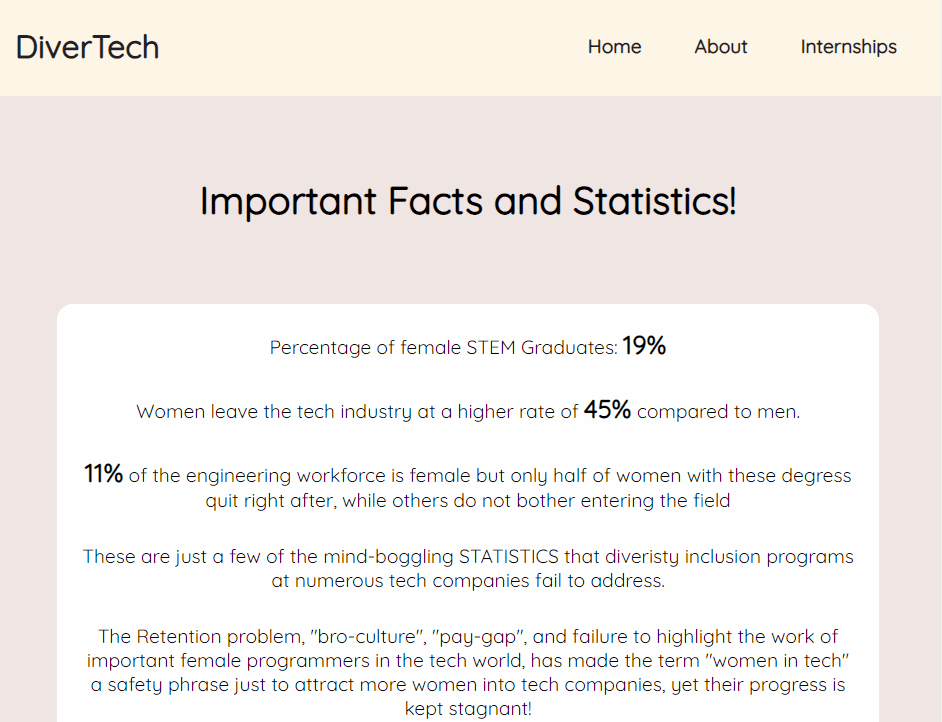

# DiverTech

## Description

Our project consists of a home page and an internship finder. The home page contains statistics about underrepresented groups in tech, and the internship finder uses both user input and our pre-set keywords to find internships on Indeed that place emphasis on underrepresented groups.

## Our vision

The goal of our project was to create something both informative and useful for underrepresented groups in tech. Since most of us are part of these groups, we brainstormed what would be useful to break into the tech field from our perspectives. The informative section represents our desire to both educate others and learn more about underrepresented groups' standing in the tech field. The internship finder is meant to increase diversity in the field by helping people of these groups start their tech careers.

## How to install and run the project

To install and run the project, you will need npm, python3, and pip installed.

1. Clone the repository
2. In a terminal, change the working directory to the project's directory

To run the web scraper API (backend)

1. Enter `cd api` while in the project's directory
2. Enter the following:

-   `pip install selenium flask`

3. To run the api, enter `python app.py` or `python3 app.py`

To run the website (frontend)

1. Open another terminal and cd in the client directory of the project (DiverTech/client)
2. Enter `npm install` to install the dependencies
3. After it finishes installing, enter `npm start`

## How to use the project

The first thing you will see is the homepage, which contains statistics about women in tech, a navigation bar with the `"Home"`, `"About"`, and `"Internships"` buttons, and the `"Internship Finder"` button at the bottom of the page. On the navigation bar, the `"About"` button takes you to a page with information about us and the project, and the `"Home"` button takes you back to the first page. Both the `"Internships"` and `"Internship Finder"` buttons take you to the internship finder.

On the internship finder page, you are prompted to either search for your desired career or click the `"Find Opportunities!"` button, which has "software engineer" as the default career. A new Chrome window will pop up, and the internship finder will look through the internships on Indeed for your career and our pre-set keywords: `"gender"`, `"sex"`, `"women"`, `"non-binary"`, `"equal opportunity"`, `"race"`, `"sexual orientation"`, and `"disability"`. When it is finished, the Chrome window closes, and several internships with their corresponding Indeed links will appear. Clicking `"Find More"` will repeat this process.

## Demo GIF

## Member contributions

**Stefani Hermanto**
 
I worked on the styling for the internship finder, as well as the descriptions for the README.
 
GitHub: https://github.com/shermanto24
 
LinkedIn: https://www.linkedin.com/in/stefani-hermanto-752211221/

**Ivan Rao**
 
I worked on the web scraper along with the frontend and backend of the internship finder
 
Github: https://github.com/irao12
 
LinkedIn: https://www.linkedin.com/in/ivan-rao/

**Stephanie Njoku**
 
I worked on some parts of the website (frontend) as well as the stats section
 
LinkedIn: https://linkedin.com/in/stephanienjoku

**Rebecca Ramsammy**
 
Github:
 
LinkedIn:
